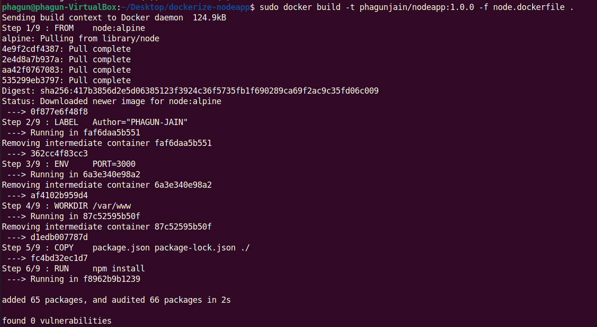
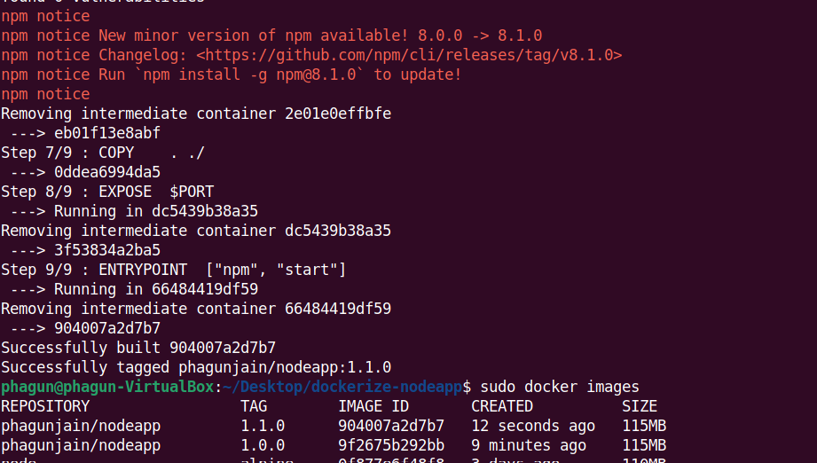
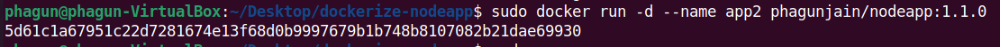
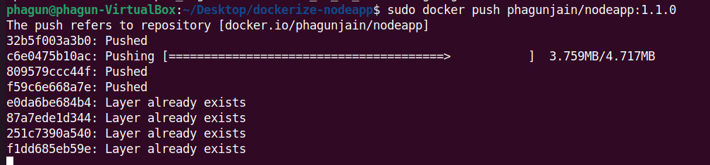

# dockerize-nodeapp

## Building a Docker Image

```Bash
    docker build -t <tag> -f node.dockerfile .
```




```Bash
    docker run -d --name <name of container> <tag>
```



```Bash
    docker push <registy_name>
```


